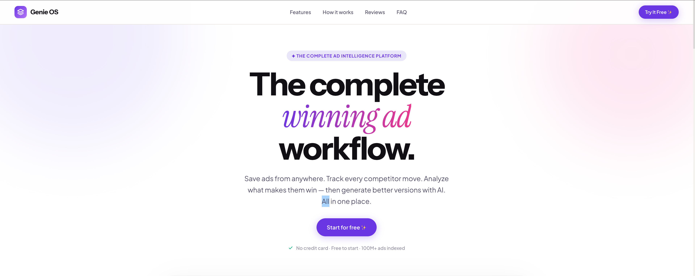
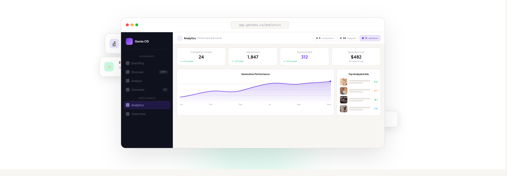

# Genie OS

**The Complete Winning Ad Workflow**

Save, analyze, and replicate winning ads. The complete workflow for performance teams obsessed with creative intelligence.





## Features

### Discover
Search 100M+ live ads across Meta, TikTok, YouTube, LinkedIn, and Google via the Foreplay API. Filter by niche, platform, and sort by longest running to find proven winners.

### Analyze
AI-powered creative breakdowns covering hook type, visual hierarchy, color psychology, social proof, CTA strength, audience targeting, and emotional triggers. Each ad gets a conversion score from 1–10.

### Generate
Create on-brand ad variations from any analyzed ad. Choose aspect ratios (4:5, 9:16, 1:1), pick between Exact Replica or AI Inspired modes, and generate visuals grounded in proven creatives. Includes Video Remix for video ad variations.

### Knowledge Base
Define your brand profile — voice, target audience, USPs, colors, fonts, logos, and product images. This context powers every AI generation so output always matches your brand.

### OpenClaw (Competitor Teardown)
Full multi-source competitive intelligence. Enter a competitor brand to pull ads from Foreplay, Meta Ad Library, and TikTok, scrape landing pages, and synthesize everything into a single actionable report.

### Analytics
Track your pipeline — competitors monitored, ads analyzed, ads generated, costs, and approval rates. Export to CSV.

## Tech Stack

- **Framework:** Next.js 16 (Turbopack) + React 19
- **Language:** TypeScript 5.9
- **Styling:** Tailwind CSS 4, Motion (Framer Motion), Radix UI
- **State:** Zustand, TanStack React Query
- **Charts:** Recharts
- **APIs:** Foreplay, Google Gemini, OpenAI, Claude, OpenRouter, Apify

## Prerequisites

- Node.js 18+
- npm

## Installation

```bash
cd "AI Ecom Engine"
npm install
```

## Environment Setup

Create a `.env.local` file with the following variables:

```env
# Required — Foreplay API (ad discovery)
FOREPLAY_API_KEY=

# Required — Google AI / Gemini (ad analysis & generation)
GOOGLE_AI_API_KEY=

# Optional — Apify (landing page scraping for teardowns)
APIFY_API_TOKEN=

# Optional — OpenClaw (local teardown server)
OPENCLAW_API_URL=http://127.0.0.1:18789
OPENCLAW_AUTH_TOKEN=
```

LLM provider keys (OpenAI, Claude, OpenRouter) are user-configurable via the in-app Settings page and stored in the browser.

### Getting API Keys

- **Foreplay:** Sign up at [Foreplay](https://foreplay.co) and get your API key from the dashboard.
- **Google AI:** Create a key at [Google AI Studio](https://aistudio.google.com/apikey).
- **Apify:** Sign up at [Apify](https://apify.com) for a token (needed for OpenClaw teardowns).

> **Important:** Never commit `.env.local` or share your API keys.

## Running the App

```bash
# Development (Turbopack)
npm run dev

# Production
npm run build
npm start
```

The app runs at [http://localhost:3000](http://localhost:3000).

## Project Structure

```
src/
├── app/
│   ├── page.tsx              # Landing page
│   ├── discover/             # Ad discovery search
│   ├── analyze/              # Competitor ad analysis
│   ├── generate/             # AI ad generation
│   ├── knowledge-base/       # Brand profile management
│   ├── openclaw/             # Competitor teardowns
│   ├── analytics/            # Analytics dashboard
│   ├── settings/             # API keys, preferences, data
│   └── api/                  # Backend routes
├── features/
│   ├── discover/             # Discover hooks
│   ├── teardown/             # OpenClaw/teardown logic
│   ├── video-remix/          # Video decomposition & remix
│   └── ui-facelift/          # Premium UI components
└── shared/
    ├── components/           # Shared UI primitives
    ├── lib/                  # Store, API helpers, utilities
    └── types/                # TypeScript type definitions
```
